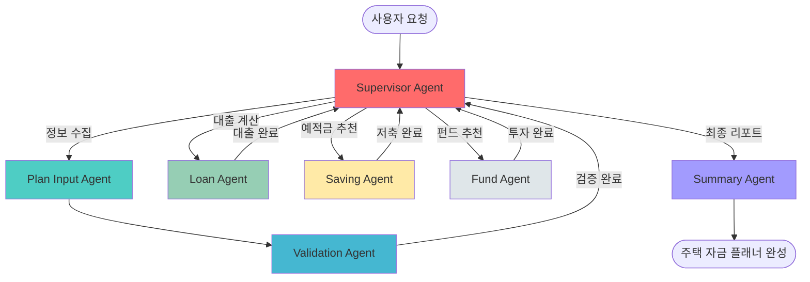
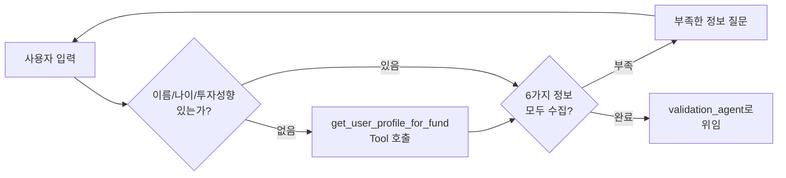
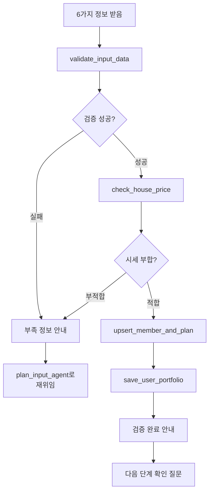
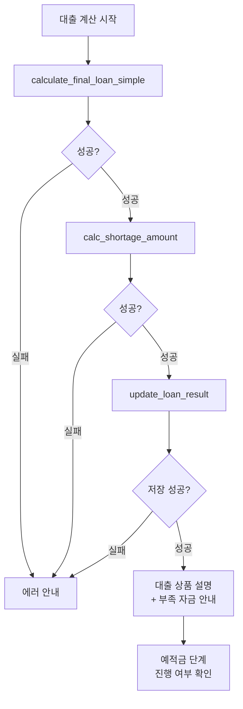
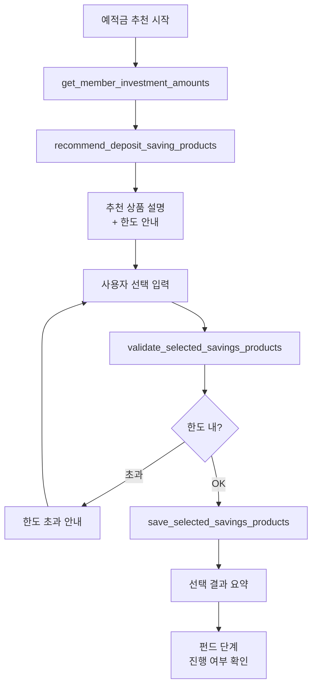
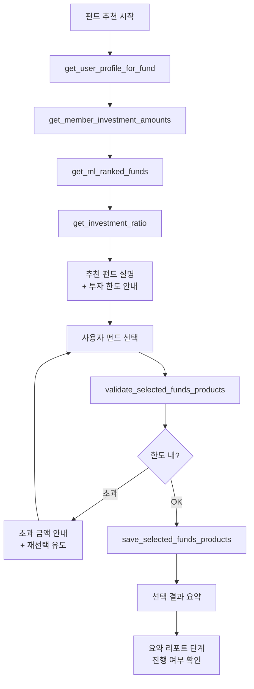
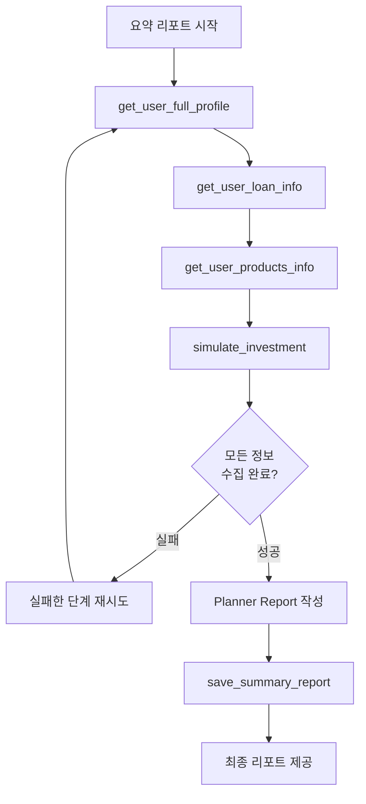
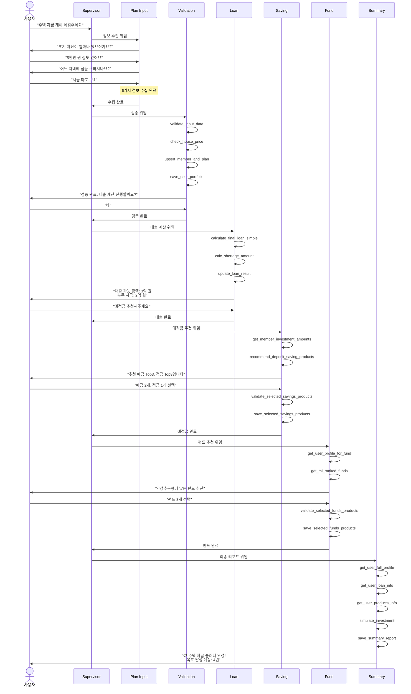

# Implementation Plan Agents 구조 및 설계 문서

주택 자금 계획 수립을 위한 7개의 에이전트가 협력하여 사용자에게 맞춤형 자산관리 플래너를 제공합니다.

---

## 📋 목차

1. [전체 아키텍처](#전체-아키텍처)
2. [에이전트 상세 설명](#에이전트-상세-설명)
   - [1. Supervisor Agent](#1-supervisor-agent)
   - [2. Plan Input Agent](#2-plan-input-agent)
   - [3. Validation Agent](#3-validation-agent)
   - [4. Loan Agent](#4-loan-agent)
   - [5. Saving Agent](#5-saving-agent)
   - [6. Fund Agent](#6-fund-agent)
   - [7. Summary Agent](#7-summary-agent)
3. [워크플로우 예시](#워크플로우-예시)

---

## 전체 아키텍처

### 에이전트 실행 순서



### 핵심 설계 원칙

- **단일 책임 원칙**: 각 에이전트는 명확한 하나의 역할만 수행
- **MCP Tool 활용**: Database 조회 및 계산 로직은 MCP Tool로 분리
- **위임 패턴**: Supervisor Agent가 전체 흐름을 조율하고 하위 에이전트에게 작업 위임
- **대화형 인터페이스**: 사용자와 자연스러운 한국어 대화로 정보 수집 및 결과 제공

---

## 에이전트 상세 설명

### 1. Supervisor Agent

#### 역할
주택 자금 계획 수립 프로세스의 최상위 조율자(Orchestrator)로서, 전체 워크플로우를 관리하고 적절한 하위 에이전트에게 작업을 위임합니다.

#### 담당 업무
- **프로세스 조율**: 사용자 요청 분석 → 적절한 에이전트 선택 → 작업 위임
- **상태 관리**: 전체 프로세스의 진행 상황 추적 및 다음 단계 결정
- **플로우 제어**: 필수 단계(입력 → 검증 → 대출 → 예적금 → 펀드 → 요약) 순서 보장

#### 설계 특징
- **MCP Tool 사용 안 함**: 직접 데이터 처리를 하지 않고, 위임만 수행
- **Delegate 전용**: `delegate` Tool을 사용하여 하위 에이전트에게 작업 전달
- **완료 판단**: 모든 필수 단계 완료 시 최종 응답 제공

#### 위임 가능 에이전트
```python
allowed_agents = [
    "plan_input_agent",    # 정보 수집
    "validation_agent",    # 데이터 검증
    "loan_agent",          # 대출 계산
    "saving_agent",        # 예적금 추천
    "fund_agent",          # 펀드 추천
    "summary_agent"        # 최종 리포트
]
```

#### 설정
| 항목 | 값 | 설명 |
|------|-----|------|
| `model` | gpt-oss-120b | 복잡한 의사결정을 위한 대형 모델 |
| `temperature` | 0.01 | 일관된 의사결정을 위한 낮은 랜덤성 |
| `max_iterations` | 15 | 충분한 위임 반복 허용 |
| `timeout` | 300초 | 넉넉한 실행 시간 |

---

### 2. Plan Input Agent

#### 역할
사용자와의 대화를 통해 주택 자금 계획 수립에 필요한 8가지 핵심 정보를 수집하는 에이전트입니다.

#### 담당 업무
- **정보 수집**: 사용자로부터 6가지 기본 정보 입력받기
  1. `initial_prop`: 초기 자산 (보유 목돈)
  2. `hope_location`: 희망 지역
  3. `hope_price`: 희망 주택 가격
  4. `hope_housing_type`: 주택 유형 (아파트, 빌라 등)
  5. `income_usage_ratio`: 월 소득 대비 저축 가능 비율
  6. `investment_ratio`: 예금:적금:펀드 자산 배분 비율

- **프로필 조회**: MCP Tool을 통해 2가지 추가 정보 자동 조회
  7. `name`: 사용자 이름
  8. `age`: 사용자 나이
  9. `invest_tendency`: 투자 성향

- **Smart Nudging**: 투자 성향 기반 자산 배분 비율 제안

#### 사용 MCP Tools
```python
allowed_tools = [
    "get_user_profile_for_fund"  # DB에서 사용자 프로필 + 투자성향 조회
]
```

#### 워크플로우


#### 설계 특징
- **대화형 수집**: 자연스러운 한국어 대화로 정보 획득
- **유연한 입력 형식**: "3천만 원", "1억 5천" 등 다양한 형식 허용
- **점진적 수집**: 한 번에 모든 정보를 요구하지 않고 대화를 통해 수집
- **검증 위임**: 데이터 검증은 Validation Agent에게 위임

---

### 3. Validation Agent

#### 역할
Plan Input Agent가 수집한 데이터를 검증·정규화하고, 시세와 비교하여 계획의 현실성을 판단한 후 DB에 저장하는 에이전트입니다.

#### 담당 업무
- **데이터 파싱**: 자연어 입력을 구조화된 데이터로 변환
  - "3천만 원" → `30000000`
  - "서울 마포구" → 정규화된 지역명
  - "40%" → `0.4`
  
- **유효성 검증**: 입력값의 논리적 타당성 확인
  - 금액 범위 검증
  - 비율 합계 검증 (예금:적금:펀드 = 100%)
  - 지역명 존재 여부 확인

- **시세 비교**: 희망 주택 가격이 해당 지역 평균 시세와 부합하는지 확인

- **DB 저장**: 검증된 데이터를 `members` 및 `plans` 테이블에 저장

#### 사용 MCP Tools
```python
allowed_tools = [
    "validate_input_data",         # 6개 필드 파싱·검증·정규화
    "check_house_price",           # 지역/유형별 평균 시세 조회
    "upsert_member_and_plan",      # members + plans 테이블 저장
    "save_user_portfolio"          # 예금/적금/펀드 배분 금액 계산 및 저장
]
```

#### 워크플로우


#### 설계 특징
- **단계별 검증**: 각 MCP Tool을 순차적으로 실행하여 단계별 검증 수행
- **에러 핸들링**: 검증 실패 시 구체적인 오류 내용 안내 및 재입력 유도
- **데이터 정규화**: 일관된 형식으로 데이터 변환하여 저장
- **사용자 확인**: 검증 완료 후 정보 요약 제공 및 다음 단계 진행 여부 확인

---

### 4. Loan Agent

#### 역할
사용자의 소득, 자산, 주택 정보를 기반으로 대출 가능 금액을 계산하고 적합한 대출 상품을 추천하는 에이전트입니다.

#### 담당 업무
- **대출 한도 계산**: LTV, DSR, DTI 규제를 고려한 현실적인 대출 가능 금액 산출
- **부족 자금 계산**: 희망 주택 가격 - 대출 가능 금액 - 보유 자산 = 부족 자금
- **대출 상품 추천**: 사용자 조건에 맞는 주택담보대출 상품 제공
- **결과 저장**: 대출 가능 금액과 부족 자금을 DB에 저장

#### 사용 MCP Tools
```python
allowed_tools = [
    "calculate_final_loan_simple",  # 대출 가능 금액 + 상품 정보 조회
    "calc_shortage_amount",         # 부족 자금 계산
    "update_loan_result"            # 대출 결과를 plans 테이블에 저장
]
```

#### 주요 계산 지표

| 지표 | 설명 | 산식 |
|------|------|------|
| **LTV** | Loan To Value<br/>주택 가격 대비 대출 비율 | (대출금 / 주택 가격) × 100 |
| **DSR** | Debt Service Ratio<br/>연소득 대비 모든 부채 상환액 비율 | (전체 부채 연간 상환액 / 연소득) × 100 |
| **DTI** | Debt To Income<br/>연소득 대비 주택대출 상환액 비율 | (주택대출 연간 상환액 / 연소득) × 100 |

#### 워크플로우


#### 설계 특징
- **규제 준수**: 정부 규제(LTV, DSR, DTI)를 반영한 정확한 대출 한도 산출
- **상품 매칭**: 사용자 조건에 맞는 실제 은행 대출 상품 추천
- **현실적 계획**: 대출 가능 금액과 부족 자금을 명확히 제시
- **표 형식 제공**: LTV, DSR, DTI 정보를 표로 정리하여 사용자에게 제공

---

### 5. Saving Agent

#### 역할
사용자의 부족 자금과 저축 목표를 고려하여 예금·적금 상품을 추천하고, 사용자가 선택한 상품을 검증 및 저장하는 에이전트입니다.

#### 담당 업무
- **투자 한도 조회**: `members` 테이블에서 예금/적금 배정 금액 확인
- **상품 추천**: 나이, 첫 거래 여부 등을 고려한 예금 Top3 + 적금 Top3 추천
- **사용자 선택**: 추천 상품 중 사용자가 원하는 상품과 투자 금액 입력 받기
- **한도 검증**: 선택한 금액이 배정된 예금/적금 한도를 초과하지 않는지 확인
- **DB 저장**: 검증된 선택 결과를 `my_products` 테이블에 저장

#### 사용 MCP Tools
```python
allowed_tools = [
    "get_member_investment_amounts",        # 예금/적금/펀드 배정 금액 조회
    "recommend_deposit_saving_products",    # 예금 Top3 + 적금 Top3 추천
    "validate_selected_savings_products",   # 선택 금액 한도 검증
    "save_selected_savings_products"        # my_products에 저장
]
```

#### 워크플로우


#### 설계 특징
- **맞춤형 추천**: 사용자 나이, 거래 이력 등을 고려한 상품 필터링
- **한도 관리**: `deposit_amount`, `savings_amount` 범위 내에서만 선택 가능
- **유연한 선택**: 사용자가 원하는 상품과 금액 자유롭게 조합 가능
- **재선택 지원**: 한도 초과 시 다시 선택할 수 있도록 안내

---

### 6. Fund Agent

#### 역할
사용자의 투자 성향과 펀드 투자 한도를 기반으로 적합한 펀드 상품을 추천하고, 선택 결과를 검증 및 저장하는 에이전트입니다.

#### 담당 업무
- **투자 성향 확인**: 안전형 ~ 공격투자형까지 5단계 투자 성향 조회
- **펀드 한도 조회**: `members` 테이블에서 `fund_amount` (펀드 배정 금액) 확인
- **ML 기반 추천**: 투자 성향에 맞는 펀드를 ML 점수 기반으로 추천
- **상품 설명**: ML 종합점수, 성과점수, 안정성점수, 수익률, 변동성 등 상세 정보 제공
- **선택 검증**: 선택한 펀드 총액이 `fund_amount`를 초과하지 않는지 확인
- **DB 저장**: 검증된 펀드 선택을 `my_products` 테이블에 저장

#### 사용 MCP Tools
```python
allowed_tools = [
    "get_user_profile_for_fund",            # 투자 성향 조회
    "get_member_investment_amounts",        # fund_amount 조회
    "get_ml_ranked_funds",                  # ML 기반 펀드 추천
    "get_investment_ratio",                 # 투자성향별 설명 조회
    "validate_selected_funds_products",     # 선택 금액 한도 검증
    "save_selected_funds_products"          # my_products에 저장
]
```

#### ML 기반 펀드 추천 정보

```json
{
  "product_name": "펀드명",
  "risk_level": "위험등급",
  "final_quality_score": 85.3,  // ML 종합점수
  "perf_score": 80.1,            // 성과 점수
  "stab_score": 90.5,            // 안정성 점수
  "evidence": {
    "return_1y": 12.5,           // 1년 수익률
    "return_3m": 3.2,            // 3개월 수익률
    "total_fee": 0.5,            // 총보수
    "fund_size": 1500,           // 펀드 규모 (억)
    "volatility_1y": 8.3,        // 변동성
    "mdd_1y": -15.2              // 최대 손실 낙폭
  }
}
```

#### 워크플로우


#### 설계 특징
- **투자 성향 기반**: 5단계 투자 성향별 맞춤형 펀드 추천
- **ML 점수 활용**: 머신러닝 모델의 종합 평가를 통한 객관적 추천
- **상세 정보 제공**: 단순 추천이 아닌 근거 데이터 함께 제공
- **위험 관리**: 한도 검증으로 과도한 투자 방지

---

### 7. Summary Agent

#### 역할
전체 주택 자금 계획 프로세스의 결과를 종합하여 최종 자산관리 플래너(Planner) 리포트를 생성하는 에이전트입니다.

#### 담당 업무
- **정보 통합**: 사용자 프로필, 대출 정보, 예적금/펀드 선택 결과 통합 조회
- **시뮬레이션**: 복리 기반 투자 시뮬레이션으로 목표 달성 예상 기간 계산
- **리포트 작성**: 전문적이고 이해하기 쉬운 종합 자산관리 리포트 생성
- **결과 저장**: 최종 리포트를 DB에 저장

#### 사용 MCP Tools
```python
allowed_tools = [
    "get_user_full_profile",    # 사용자 전체 프로필 조회
    "get_user_products_info",   # 선택한 예적금/펀드 상품 조회
    "get_user_loan_info",       # 대출 정보 및 상품 설명 조회
    "simulate_investment",      # 복리 투자 시뮬레이션
    "save_summary_report"       # 리포트 DB 저장
]
```

#### 리포트 구성 요소

| 섹션 | 내용 |
|------|------|
| **1. 재무·대출 현황 요약** | 소득, 자산, 희망 주택 가격, 대출 상품/금액, 부족 자금, 현실성 평가 |
| **2. 예금·적금 전략** | 추천 상품 1~3개, 각 상품의 역할(비상자금/단기자금), 금리 수준 |
| **3. 펀드 전략** | 추천 펀드 1~3개, 위험/수익 균형, 투자성향 부합 여부 |
| **4. 목표 달성 시나리오** | 예상 달성 기간, 월 투자 규모, 예적금 vs 펀드 비중, 복리 효과 |
| **5. 종합 코멘트** | 계획의 강점, 유의사항, 향후 6~12개월 점검 포인트 |

#### 워크플로우


#### 시뮬레이션 결과 예시
```json
{
  "target_achievement_months": 48,        // 목표 달성 예상 기간 (개월)
  "target_achievement_date": "2029-01",   // 목표 달성 예상 날짜
  "total_principal": 120000000,           // 총 투자 원금
  "total_returns": 28500000,              // 총 수익금
  "return_rate": 23.75,                   // 수익률 (%)
  "final_savings_balance": 75000000,      // 예적금 최종 잔액
  "final_fund_balance": 73500000          // 펀드 최종 잔액
}
```

#### 설계 특징
- **포괄적 요약**: 전체 프로세스의 모든 결과를 한 눈에 파악 가능
- **전문적 분석**: 단순 나열이 아닌 인사이트 제공
- **시각적 구성**: 표와 구조화된 포맷으로 가독성 향상
- **실행 가능한 조언**: 향후 점검 포인트 제시로 실용성 확보

---

## 워크플로우 예시

### 완전한 주택 자금 계획 수립 과정



---

## 기술 스택 및 설정

### 공통 기술 스택
- **Framework**: LangGraph + LangChain
- **LLM Models**: 
  - `gpt-oss-120b`: 복잡한 의사결정 (Supervisor, Input, Validation, Loan, Saving)
  - `gpt-oss-20b`: 창의적 생성 (Fund, Summary)
- **MCP (Model Context Protocol)**: Database 조회 및 비즈니스 로직 처리
- **Database**: MySQL (members, plans, my_products 테이블)

### 에이전트별 설정 요약

| Agent | Model | Temp | Max Iter | Timeout | 특징 |
|-------|-------|------|----------|---------|------|
| **Supervisor** | 120b | 0.01 | 15 | 300s | 일관된 의사결정 |
| **Plan Input** | 120b | 0.01 | 15 | 300s | 대화형 정보 수집 |
| **Validation** | 120b | 0.01 | 10 | 180s | 정확한 검증 |
| **Loan** | 120b | 0.01 | 12 | 240s | 정밀한 계산 |
| **Saving** | 120b | 0.01 | 15 | 240s | 상품 추천 및 선택 |
| **Fund** | 20b | 0.01 | 15 | 240s | ML 기반 추천 |
| **Summary** | 20b | 0.4 | 12 | 300s | 창의적 리포트 작성 |

---

## 주요 설계 패턴

### 1. Delegation Pattern (위임 패턴)
- **Supervisor Agent**가 전체 흐름을 제어
- 각 단계마다 적절한 전문 에이전트에게 작업 위임
- 에이전트 간 느슨한 결합 유지

### 2. Tool Separation (도구 분리)
- **비즈니스 로직**과 **대화 로직** 분리
- MCP Tool: 데이터 조회, 계산, 검증, 저장
- Agent: 사용자 대화, 흐름 제어, 결과 설명

### 3. Sequential Validation (순차적 검증)
- 각 에이전트가 단계별로 검증 수행
- 실패 시 이전 단계로 복귀 또는 재시도
- 최종 단계에서 모든 데이터 신뢰성 보장

### 4. State Management (상태 관리)
- LangGraph의 `AgentState`를 통한 상태 공유
- 각 에이전트 실행 결과가 state에 누적
- Supervisor가 state 기반으로 다음 에이전트 결정

---

## 파일 구조

```
agent/
├── agents/
│   ├── implementations/
│   │   ├── supervisor_agent.py       # Supervisor Agent
│   │   ├── input_agent.py            # Plan Input Agent
│   │   ├── validation_agent.py       # Validation Agent
│   │   ├── loan_agent_node.py        # Loan Agent
│   │   ├── saving_agent.py           # Saving Agent
│   │   ├── fund_agent.py             # Fund Agent
│   │   └── summary_agent.py          # Summary Agent
│   ├── config/
│   │   └── plan_agents.yaml          # 에이전트 설정 파일
│   ├── base/
│   │   ├── agent_base.py             # 에이전트 기본 클래스
│   │   └── agent_base_prompts.py     # 공통 프롬프트
│   └── registry/
│       └── agent_registry.py         # 에이전트 등록 관리
└── graph/
    └── config/
        └── plan_graph.yaml           # LangGraph 구조 정의
```

---

## 확장 가능성

### 추가 가능한 에이전트
- **Report Agent**: 월간/분기별 자산 리포트 자동 생성
- **Risk Management Agent**: 리스크 분석 및 경고
- **Tax Agent**: 세금 최적화 전략 제안
- **Rebalancing Agent**: 포트폴리오 재조정 추천

### 개선 포인트
- **병렬 처리**: 독립적인 에이전트는 병렬 실행으로 속도 향상
- **캐싱**: 반복 조회되는 데이터 캐싱으로 성능 개선
- **A/B 테스트**: 다양한 프롬프트 및 모델 설정 실험
- **사용자 피드백**: 추천 결과에 대한 만족도 수집 및 학습

---

## 관련 문서
- [Agent 시스템 전체 README](./README.md)
- [MCP Tools 문서](../mcp/README.md)
- [Frontend Plan 페이지](../frontend/src/crm/pages/Plan.tsx)
