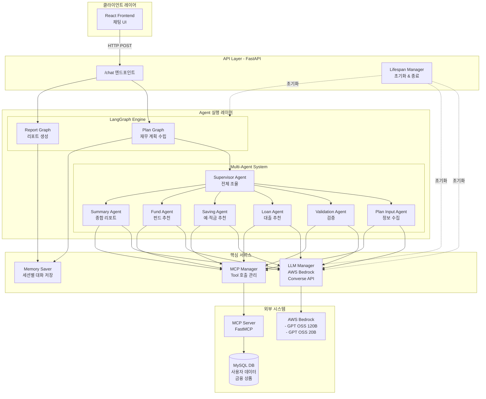
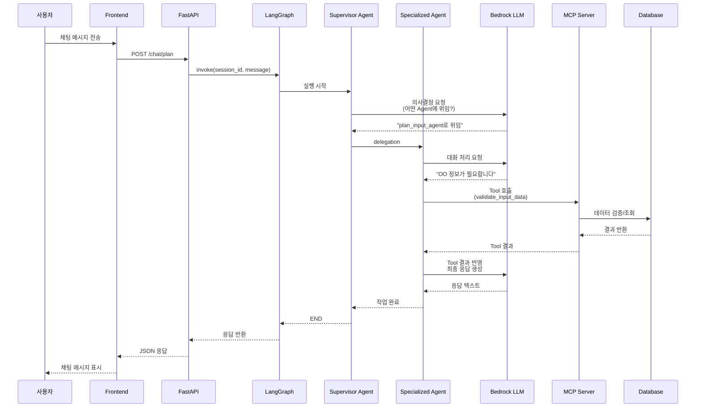
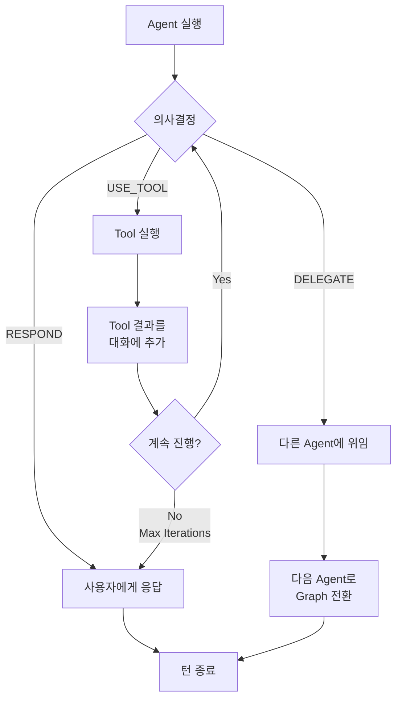
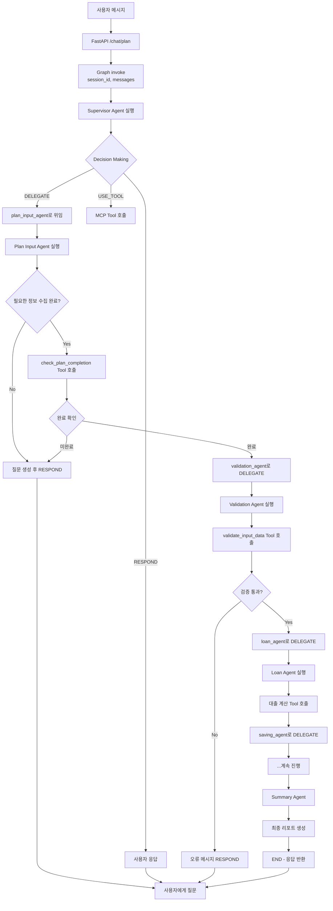
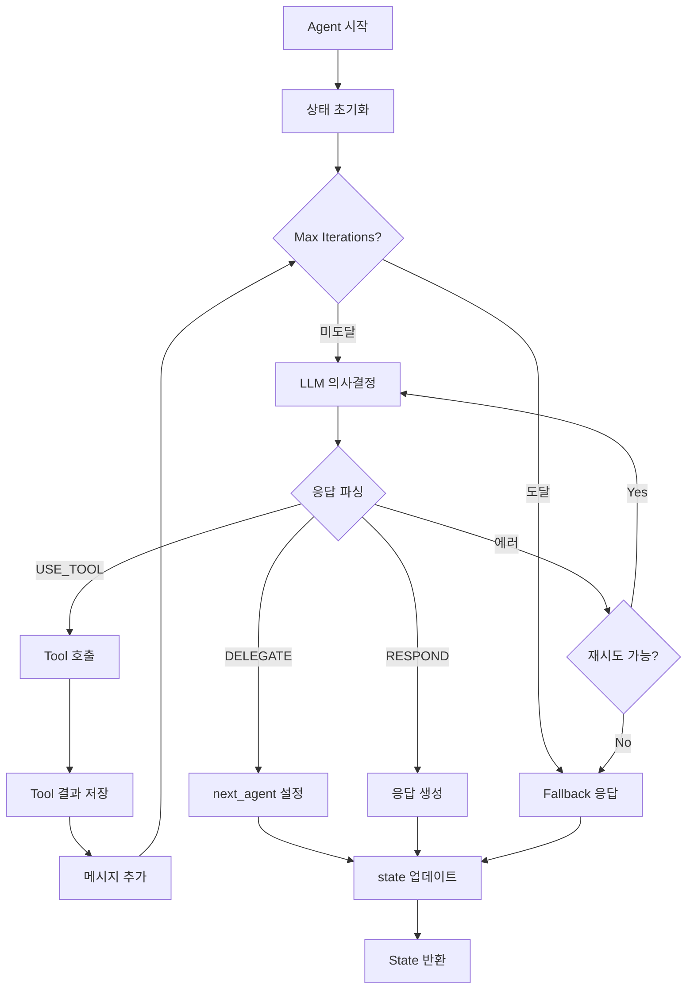

# Multi-Agent 기반 재무 계획 시스템 - 기술문서

> AWS Bedrock, LangGraph, MCP를 활용한 대화형 AI 재무 상담 시스템

## 📋 목차

- [프로젝트 개요](#-프로젝트-개요)
- [시스템 아키텍처](#-시스템-아키텍처)
- [Agent 시스템 설계](#-agent-시스템-설계)
- [핵심 컴포넌트](#-핵심-컴포넌트)
- [실행 플로우](#-실행-플로우)
- [프로젝트 구조](#-프로젝트-구조)
- [기술 스택](#-기술-스택)
- [빠른 시작](#-빠른-시작)

---

## 🎯 프로젝트 개요

### 개발 의도

본 프로젝트는 **대화형 AI를 활용한 맞춤형 재무 계획 수립 서비스**를 제공하기 위해 개발되었습니다. 사용자의 주택 구매 계획, 소득 정보, 투자 성향 등을 대화를 통해 수집하고, 이를 기반으로 대출, 예·적금, 펀드 등을 종합적으로 추천하는 **프리미엄 자산관리 솔루션**입니다.

### 핵심 설계 철학

1. **모듈화된 Agent 아키텍처**: 각 업무 영역(입력, 검증, 대출, 예금, 펀드, 요약)을 독립적인 Agent로 분리하여 유지보수성과 확장성 확보
2. **Graph 기반 워크플로우**: LangGraph를 활용한 복잡한 Business Logic의 시각화 및 관리
3. **MCP(Model Context Protocol) 통합**: 외부 도구(DB 조회, 금융 상품 검색, 데이터 검증)를 표준화된 인터페이스로 통합
4. **Enterprise-Grade LLM 활용**: AWS Bedrock의 안정적이고 확장 가능한 LLM 인프라 활용

---

## 🏗️ 시스템 아키텍처

### 전체 아키텍처 다이어그램



### 서비스 흐름도



---

## 🤖 Agent 시스템 설계

### Agent 기본 구조

모든 Agent는 `AgentBase` 클래스를 상속받아 구현됩니다. 이는 멀티턴 대화, Tool 호출, 의사결정 등의 핵심 기능을 제공합니다.

```python
# agents/base/agent_base.py

class AgentBase(ABC):
    """
    멀티턴 Tool 호출을 지원하는 Agent 베이스 클래스
    
    핵심 설계:
    - LLMHelper를 통한 Bedrock Converse API 직접 호출
    - MCP Tool 동적 로딩 및 실행
    - 대화 히스토리 자동 압축 (toolUse/toolResult 쌍 보존)
    - Graph 기반 Agent 간 Delegation
    """
    
    def __init__(self, config: BaseAgentConfig):
        # Agent 설정 (YAML에서 로드)
        # LLM 설정, Tool 설정, 타임아웃 등
        
    def run(self, state: AgentState) -> AgentState:
        """Agent 실행 메인 플로우"""
        
    def execute_multi_turn(self, state: AgentState):
        """멀티턴 실행 - Tool 호출 반복 처리"""
        
    def _make_decision(self, state, messages, available_tools):
        """Agent 의사결정 - USE_TOOL / DELEGATE / RESPOND"""
```

### Agent 의사결정 프로세스

각 Agent는 매 턴마다 다음 3가지 행동 중 하나를 선택합니다:



### Agent 구성 (Plan Graph)

| Agent 명 | 역할 | 주요 Tool | LLM 모델 |
|----------|------|-----------|----------|
| **supervisor_agent** | 전체 플로우 조율, Agent 간 라우팅 결정 | - | GPT OSS 120B |
| **plan_input_agent** | 사용자와 대화하며 주택 계획 정보 수집 | `check_plan_completion` | GPT OSS 120B |
| **validation_agent** | 입력 데이터 검증 및 정규화 | `validate_input_data`<br/>`normalize_location`<br/>`parse_currency` | GPT OSS 120B |
| **loan_agent** | DSR/LTV 계산, 대출 한도 산출, 상품 추천 | `calculate_dsr`<br/>`get_loan_products`<br/>`save_loan_result` | GPT OSS 120B |
| **saving_agent** | 예·적금 상품 추천 및 사용자 선호 입력 | `get_savings_products`<br/>`save_selected_savings` | GPT OSS 120B |
| **fund_agent** | 투자 성향 분석, 펀드 상품 추천 | `get_fund_products`<br/>`save_selected_funds` | GPT OSS 20B |
| **summary_agent** | 최종 종합 리포트 생성 | `get_user_full_profile`<br/>`save_final_report` | GPT OSS 20B |

---

## 🔧 핵심 컴포넌트

### 1. LLM Manager (AWS Bedrock Converse API)

**위치**: `core/llm/llm_manger.py`

AWS Bedrock의 **Converse API**를 직접 호출하여 LLM 통신을 처리합니다.

```python
class LLMManager:
    """LLM 관리 클래스 (싱글톤)"""
    
    @classmethod
    def _call_bedrock_converse(cls, messages, model_id, region, 
                                tool_config=None, tool_choice=None, **kwargs):
        """
        AWS Bedrock Converse API 호출
        
        특징:
        - System Prompt를 system 파라미터로 분리 전달
        - Tool Definition을 toolConfig로 전달
        - Extended Thinking 모델의 내부 토큰 필터링
        """
```

#### System Prompt 처리 방식

Agent의 Implementation Prompt와 Decision Prompt를 **하나의 System Prompt**로 통합하여 Bedrock API의 `system` 파라미터로 전달:

```python
# Decision Prompt + Agent Implementation Prompt를 결합
system_prompt = DECISION_PROMPT + "\n\n" + agent.implementation_prompt

# Bedrock API 호출 시
bedrock_client.converse(
    modelId=model_id,
    system=[{"text": system_prompt}],  # 👈 System으로 전달
    messages=[...],  # 사용자/어시스턴트 대화만
    toolConfig={...}
)
```

### 2. MCP Manager (Model Context Protocol)

**위치**: `core/mcp/mcp_manager.py`

FastMCP를 활용하여 외부 Tool을 표준화된 인터페이스로 제공합니다.

```python
class MCPManager:
    """MCP 클라이언트 싱글톤 매니저"""
    
    async def call_tool(self, name: str, args: Dict[str, Any], max_retries=3):
        """
        Tool 호출 (자동 재시도 + 동시성 안전)
        
        특징:
        - 연결 끊김 시 자동 재연결
        - Lock을 통한 동시 호출 방지
        - exponential backoff 재시도
        """
```

#### MCP Tool 변환 프로세스

MCP Server의 Tool 스펙을 Bedrock `toolConfig` 형식으로 변환:

```python
# AgentBase._convert_mcp_tool_to_bedrock()
def _convert_mcp_tool_to_bedrock(self, tool_spec):
    """
    MCP Tool 스펙을 Bedrock toolConfig 형식으로 변환
    
    MCP 형식:
    {
        "name": "validate_input_data",
        "inputSchema": {
            "type": "object",
            "properties": {...}
        }
    }
    
    Bedrock 형식:
    {
        "toolSpec": {
            "name": "validate_input_data",
            "description": "...",
            "inputSchema": {
                "json": {...}
            }
        }
    }
    """
```

### 3. Graph Factory (LangGraph 워크플로우)

**위치**: `graph/factory.py`

YAML 설정 파일을 기반으로 LangGraph를 동적으로 생성합니다.

```python
def mk_graph(yaml_path, checkpointer=None, config_loader=None):
    """
    YAML 설정에서 Agent 그래프 생성
    
    처리 과정:
    1. YAML 파일 로드 (nodes, edges, entry_point)
    2. AgentConfigLoader를 통한 Agent 설정 로드
    3. GraphBuilder를 통한 노드/엣지 구성
    4. Router 등록 및 Conditional Edge 설정
    5. Checkpointer 연결 (세션별 메모리)
    """
```

#### Graph YAML 구조 예시

```yaml
# graph/config/plan_graph.yaml

nodes:
  - name: supervisor_agent
    agent: supervisor_agent
    config:
      max_iterations: 10

  - name: plan_input_agent
    agent: plan_input_agent

edges:
  conditional:
    - from: supervisor_agent
      router: DynamicRouter
      paths:
        plan_input_agent: plan_input_agent
        validation_agent: validation_agent
        loan_agent: loan_agent
        END: __end__

entry_point: supervisor_agent
```

### 4. Dynamic Router (조건부 라우팅)

**위치**: `graph/routing/dynamic_router.py`

Agent의 실행 결과(`status`, `next_agent`)를 기반으로 다음 노드를 동적 결정합니다.

```python
class DynamicRouter(RouterBase):
    """Agent의 delegation 결정을 반영하는 동적 Router"""
    
    def route(self, state: AgentState) -> str:
        """
        우선순위:
        1. Agent가 명시한 next_agent (delegation)
        2. 실행 상태 (SUCCESS → END, FAILED → END)
        3. 기본값 (END)
        """
```

### 5. Memory Management (세션별 대화 저장)

**위치**: `api/lifespan.py`

각 Graph별로 독립적인 `MemorySaver` 인스턴스를 생성하여 세션 격리를 보장합니다.

```python
# Graph별 독립적인 Memory
app.state.graphs = {
    "plan": {
        "graph": plan_graph,
        "checkpointer": MemorySaver(),  # Plan 전용
        "config_loader": plan_config_loader
    },
    "report": {
        "graph": report_graph,
        "checkpointer": MemorySaver(),  # Report 전용
        "config_loader": report_config_loader
    }
}
```

같은 `session_id`라도 `plan` 그래프와 `report` 그래프의 대화는 **완전히 독립적**으로 관리됩니다.

### 6. Conversation History Compression

**위치**: `agents/base/agent_base.py`

대화가 길어지면 자동으로 히스토리를 압축하여 Context Window를 효율적으로 관리합니다.

```python
def _compress_history_safely(self, messages: List):
    """
    히스토리 압축 - toolUse/toolResult 쌍 보존
    
    압축 전략:
    1. 최근 N개 메시지는 보존
    2. 오래된 메시지는 user-assistant 쌍으로 요약
    3. toolUse와 toolResult는 항상 쌍으로 보존
       (Bedrock API 제약사항)
    """
```

---

## 🔄 실행 플로우

### 사용자 요청부터 응답까지



### Agent 내부 멀티턴 플로우



---

## 📁 프로젝트 구조

```
Final_Project/
├── agent/                          # Agent 시스템 메인
│   ├── main.py                     # FastAPI 서버 진입점
│   │
│   ├── agents/                     # Agent 구현체
│   │   ├── base/
│   │   │   ├── agent_base.py      # Agent 베이스 클래스
│   │   │   └── agent_base_prompts.py  # 공통 Decision Prompt
│   │   │
│   │   ├── config/
│   │   │   ├── agent_config_loader.py  # YAML 설정 로더
│   │   │   ├── base_config.py          # AgentConfig, AgentState 정의
│   │   │   ├── plan_agents.yaml        # Plan Graph Agent 설정
│   │   │   └── report_agents.yaml      # Report Graph Agent 설정
│   │   │
│   │   ├── implementations/        # 구체적인 Agent 구현
│   │   │   ├── supervisor_agent.py     # 최상위 조율자
│   │   │   ├── input_agent.py          # 정보 수집
│   │   │   ├── validation_agent.py     # 검증
│   │   │   ├── loan_agent_node.py      # 대출 추천
│   │   │   ├── saving_agent.py         # 예·적금 추천
│   │   │   ├── fund_agent.py           # 펀드 추천
│   │   │   └── summary_agent.py        # 종합 리포트
│   │   │
│   │   └── registry/
│   │       └── agent_registry.py       # Agent 자동 등록 관리
│   │
│   ├── api/                        # FastAPI 관련
│   │   ├── app.py                  # FastAPI 앱 설정
│   │   ├── lifespan.py             # 앱 초기화/종료 로직
│   │   ├── models/
│   │   │   ├── request.py          # 요청 모델
│   │   │   └── response.py         # 응답 모델
│   │   └── routes/
│   │       ├── chat.py             # 채팅 엔드포인트
│   │       └── health.py           # 헬스체크
│   │
│   ├── core/                       # 핵심 서비스
│   │   ├── config/
│   │   │   └── setting.py          # 환경 변수 설정
│   │   ├── llm/
│   │   │   └── llm_manger.py       # Bedrock LLM 관리
│   │   ├── logging/
│   │   │   └── logger.py           # 로깅 설정
│   │   └── mcp/
│   │       └── mcp_manager.py      # MCP 클라이언트 관리
│   │
│   ├── graph/                      # LangGraph 워크플로우
│   │   ├── builder/
│   │   │   └── graph_builder.py    # Graph 빌더
│   │   ├── config/
│   │   │   ├── plan_graph.yaml     # Plan 워크플로우 정의
│   │   │   └── report_graph.yaml   # Report 워크플로우 정의
│   │   ├── routing/
│   │   │   ├── dynamic_router.py   # 동적 라우팅
│   │   │   ├── router_base.py      # Router 베이스
│   │   │   └── router_registry.py  # Router 등록 관리
│   │   └── factory.py              # Graph 팩토리
│   │
│   └── utils/
│       └── session_manager.py      # 세션 관리 (deprecated)
│
├── mcp/                            # MCP Server (FastMCP)
│   ├── server/
│   │   ├── mcp_server.py          # MCP 서버 진입점
│   │   ├── routes/                # Tool 라우트
│   │   │   ├── plan_tools.py      # Plan 관련 Tool
│   │   │   └── report_tools.py    # Report 관련 Tool
│   │   ├── schemas/               # Pydantic 스키마
│   │   │   ├── plan_schema.py     # Plan Tool 스키마
│   │   │   └── report_schema.py   # Report Tool 스키마
│   │   └── data/                  # 데이터 처리 로직
│   └── main.py                    # MCP 서버 실행
│
├── backend/                        # REST API 서버 (사용자 관리 등)
├── frontend/                       # React 프론트엔드
└── logs/                           # 로그 디렉토리
```

### 주요 디렉토리 설명

#### `agents/`
- **base/**: 모든 Agent가 상속받는 `AgentBase` 클래스 및 공통 Prompt
- **config/**: Agent별 설정을 YAML로 관리 (LLM 모델, 타임아웃, max_iterations 등)
- **implementations/**: 각 업무 영역별 Agent 구현체
- **registry/**: Agent 자동 발견 및 등록 시스템

#### `core/`
- **llm/**: AWS Bedrock Converse API 통신 관리
- **mcp/**: MCP Server와의 통신 및 Tool 호출 관리
- **config/**: 환경 변수 및 전역 설정
- **logging/**: 구조화된 로깅 시스템

#### `graph/`
- **builder/**: LangGraph StateGraph 빌더
- **config/**: Graph 워크플로우를 YAML로 정의
- **routing/**: Conditional Edge를 위한 Router 구현
- **factory/**: YAML → LangGraph 변환

#### `mcp/server/`
- **routes/**: FastMCP Tool 엔드포인트 (DB 조회, 계산, 저장 등)
- **schemas/**: Tool의 입출력 Pydantic 모델
- **data/**: 실제 비즈니스 로직 (대출 계산, 상품 검색 등)

---

## 🛠️ 기술 스택

### Backend
- **Python 3.11+**
- **FastAPI**: 고성능 비동기 웹 프레임워크
- **LangGraph**: Agent 워크플로우 관리
- **AWS Bedrock**: Enterprise LLM (Converse API)
- **FastMCP**: Model Context Protocol 서버

### LLM
- **GPT OSS 120B** (`openai.gpt-oss-120b-1:0`): 복잡한 추론 작업
- **GPT OSS 20B** (`openai.gpt-oss-20b-1:0`): 빠른 응답 생성

### Database
- **MySQL**: 사용자 데이터, 금융 상품, 거래 내역

### Infrastructure
- **Docker**: 컨테이너화
- **AWS**: 클라우드 인프라
- **uv**: Python 패키지 관리

---

## 🚀 빠른 시작

### 개발 환경 설정

```bash
# 1. 저장소 클론
cd /Users/kimseonguk/Desktop/Final_Project/agent

# 2. 의존성 설치
make install  # 또는 uv sync

# 3. 환경 변수 설정
cp .env.example .env
# .env 파일에서 다음 설정:
# - AWS_BEARER_TOKEN_BEDROCK
# - BEDROCK_MODEL_ID
# - MCP_URL
# - DATABASE 정보

# 4. MCP 서버 실행 (별도 터미널)
cd ../mcp
uv run fastmcp run server/mcp_server.py

# 5. Agent 서버 실행
cd ../agent
make dev  # 또는 uvicorn main:app --reload --port 8080
```

### Docker 배포

```bash
# 1. 환경 변수 설정
cp .env.example .env

# 2. 배포 스크립트 실행
make deploy

# 또는 수동으로
docker-compose up -d

# 3. 로그 확인
docker-compose logs -f agent
```

### API 사용 예시

```bash
# 채팅 요청
curl -X POST http://localhost:8080/chat/plan \
  -H "Content-Type: application/json" \
  -d '{
    "session_id": "user_12345",
    "message": "3억원 아파트 구매를 계획 중입니다."
  }'

# 세션 히스토리 조회
curl http://localhost:8080/chat/session/user_12345/history

# 헬스체크
curl http://localhost:8080/health
```

---

## 🔍 주요 특징

### 1. **그래프별 독립적인 메모리 관리**
- Plan 그래프와 Report 그래프는 완전히 독립적인 `MemorySaver` 인스턴스 사용
- 같은 `session_id`라도 그래프별로 대화 히스토리 분리

### 2. **Agent별 개별 설정**
- YAML 기반 설정으로 Agent별 LLM 모델, 타임아웃, max_iterations 독립 관리
- Plan과 Report에서 다른 Agent 구성 가능

### 3. **자동 히스토리 압축**
- Context Window 초과 시 자동으로 오래된 대화 요약
- toolUse/toolResult 쌍 보존으로 Bedrock API 제약 준수

### 4. **강건한 Tool 실행**
- MCP 연결 끊김 시 자동 재연결
- Exponential backoff 재시도
- Lock 기반 동시 호출 방지

### 5. **엔터프라이즈급 보안**
- 환경 변수 기반 민감 정보 관리
- 비root 사용자로 컨테이너 실행
- 헬스체크 및 모니터링

---

## 📊 성능 및 제약사항

### Context Window 관리
- **최대 메시지 수**: 50개 (이후 자동 압축)
- **압축 전략**: 최근 20개 보존, 나머지 요약

### 동시성
- **MCP Tool 호출**: Lock 기반 순차 실행
- **Graph 실행**: 세션별 독립 실행

### 타임아웃
- **Agent 실행**: 180~300초 (Agent별 설정)
- **Tool 호출**: 30초 (MCP)
- **LLM 호출**: 180초 (Bedrock)

---

## 🐛 트러블슈팅

### MCP 연결 오류
```bash
# MCP 서버 상태 확인
curl http://localhost:3000/health

# 연결 재시도 횟수 조정 (.env)
AGENT_MCP_CONNECTION_RETRIES=5
```

### Tool 이름 형식 오류
- Bedrock API는 Tool 이름에 `[a-zA-Z0-9_-]+` 패턴만 허용
- 특수문자가 포함된 Tool은 자동으로 sanitize됨

### 대화 히스토리 복원 실패
- 압축된 히스토리는 `compressed_history` 필드에 별도 저장
- 압축 전 원본은 보존되지 않음

---

## 📝 환경 변수

주요 환경 변수 목록 (`.env` 파일):

```bash
# 환경
AGENT_ENVIRONMENT=production
AGENT_DEBUG=false

# API 서버
AGENT_API_HOST=0.0.0.0
AGENT_API_PORT=8080
AGENT_API_VERSION=1.0.0

# AWS Bedrock
AGENT_AWS_REGION=us-east-1
AGENT_AWS_BEARER_TOKEN_BEDROCK=xxxxx
AGENT_BEDROCK_MODEL_ID=openai.gpt-oss-120b-1:0
AGENT_BEDROCK_TEMPERATURE=0.7
AGENT_BEDROCK_TOP_P=0.9
AGENT_BEDROCK_MAX_TOKENS=4096

# MCP Server
AGENT_MCP_URL=http://localhost:3000
AGENT_MCP_CONNECTION_RETRIES=3
AGENT_MCP_CONNECTION_TIMEOUT=10

# Agent 설정
AGENT_AGENTS_MODULE_PATH=agents.implementations
AGENT_MAX_ITERATIONS=15
AGENT_TIMEOUT=300
```

---

## 🧪 테스트

```bash
# 단위 테스트
make test

# 특정 테스트
pytest tests/agents/test_agent_base.py -v

# 커버리지
pytest --cov=agents --cov-report=html
```

---

## 📈 향후 개선 방향

1. **스트리밍 응답**: Bedrock `converse_stream()` API 활용
2. **RAG 통합**: 금융 문서 검색 기능 추가
3. **멀티모달**: 문서 이미지 분석 지원
4. **A/B 테스트**: Agent 성능 비교 프레임워크
5. **모니터링**: Prometheus + Grafana 대시보드

---

## 🤝 기여

이 프로젝트는 우리은행 프리미엄 자산관리 솔루션의 일부입니다.

---

## 📄 라이선스

MIT License

---

## 📞 문의

프로젝트 관련 문의사항은 이슈로 등록해 주세요.
