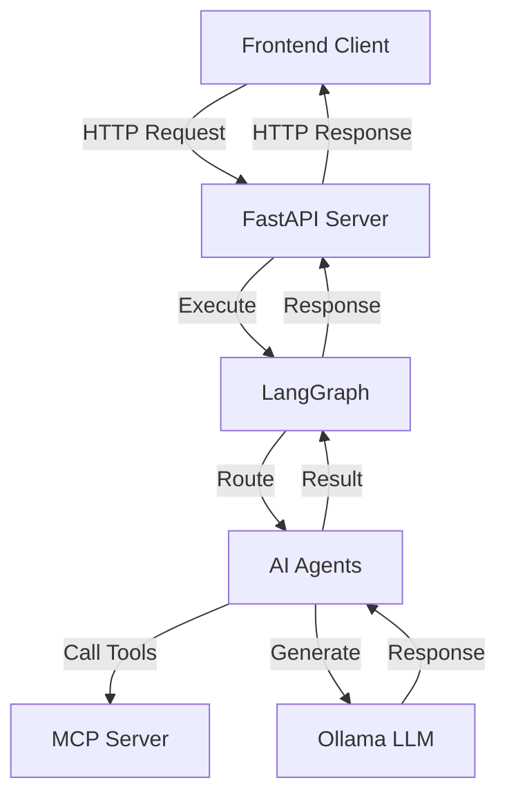
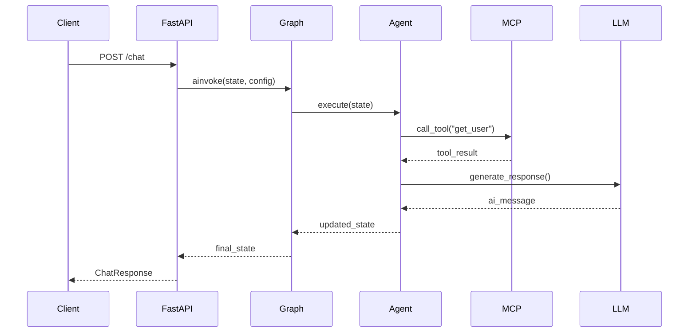

# Multi-Agent System 기술 문서

> **작성일:** 2025-11-23  
> **버전:** 2.1.0  
> **대상:** 개발팀원

---

## 📋 목차

1. [프로젝트 개요](#프로젝트-개요)
2. [시스템 아키텍처](#시스템-아키텍처)
3. [폴더 구조](#폴더-구조)
4. [핵심 컴포넌트](#핵심-컴포넌트)
5. [동작 흐름](#동작-흐름)
6. [Agent 개발 가이드](#agent-개발-가이드)
7. [Graph 개발 가이드](#graph-개발-가이드)
8. [배포 가이드](#배포-가이드)
9. [트러블슈팅](#트러블슈팅)

---

## 프로젝트 개요

### 시스템 설명

Multi-Agent System은 **LangGraph 기반의 다중 에이전트 시스템**으로, 여러 AI Agent가 협력하여 복잡한 작업을 수행합니다.

### 주요 기능

- ✅ **다중 Agent 협업**: 여러 Agent가 동적으로 라우팅되며 작업 수행
- ✅ **MCP 통합**: Model Context Protocol을 통한 외부 도구 연동
- ✅ **세션 관리**: 사용자별 대화 히스토리 관리
- ✅ **동시성 안전**: 세션별 잠금으로 안전한 동시 요청 처리
- ✅ **설정 기반**: YAML 파일로 Agent 및 Graph 구성

### 기술 스택

| 분류 | 기술 |
|------|------|
| **프레임워크** | FastAPI, LangGraph |
| **LLM** | Ollama (qwen3:8b) |
| **프로토콜** | MCP (Model Context Protocol) |
| **데이터베이스** | In-Memory (MemorySaver) |
| **배포** | Docker, Docker Compose |
| **패키지 관리** | uv |

---

## 시스템 아키텍처

### 전체 구조



### 레이어 구조

```
┌─────────────────────────────────────┐
│         API Layer (FastAPI)         │  ← HTTP 요청/응답 처리
├─────────────────────────────────────┤
│      Graph Layer (LangGraph)        │  ← Agent 플로우 관리
├─────────────────────────────────────┤
│       Agent Layer (Agents)          │  ← 비즈니스 로직 실행
├─────────────────────────────────────┤
│    Core Layer (LLM, MCP, Config)    │  ← 공통 기능 제공
└─────────────────────────────────────┘
```

---

## 폴더 구조

### 전체 구조

```
agent/
├── agents/              # Agent 관련 코드
│   ├── base/           # Agent 기본 클래스
│   ├── config/         # Agent 설정 (YAML)
│   ├── implementations/# Agent 구현체
│   └── registry/       # Agent 등록 및 관리
│
├── api/                # FastAPI 애플리케이션
│   ├── models/         # Request/Response 모델
│   ├── routes/         # API 엔드포인트
│   ├── app.py          # FastAPI 앱 생성
│   └── lifespan.py     # 앱 라이프사이클
│
├── core/               # 핵심 기능
│   ├── config/         # 설정 관리
│   ├── llm/            # LLM 관리
│   ├── logging/        # 로깅
│   └── mcp/            # MCP 클라이언트
│
├── graph/              # LangGraph 관련
│   ├── builder/        # Graph 빌더
│   ├── config/         # Graph 설정 (YAML)
│   ├── routing/        # 라우터 구현
│   └── factory.py      # Graph 생성 팩토리
│
├── utils/              # 유틸리티
│   └── session_manager.py
│
├── main.py             # 서버 실행 진입점
├── pyproject.toml      # 프로젝트 설정
└── docker-compose.yml  # Docker 구성
```

### 주요 폴더 상세 설명

#### 1. `agents/` - Agent 관련 코드

**역할:** AI Agent의 정의, 구현, 관리를 담당

| 하위 폴더 | 설명 | 주요 파일 |
|-----------|------|-----------|
| `base/` | Agent 기본 클래스 및 프롬프트 | `agent_base.py`, `agent_base_prompts.py` |
| `config/` | Agent 설정 파일 | `agents.yaml`, `agent_config_loader.py` |
| `implementations/` | 실제 Agent 구현체 | `user_creation.py`, `user_check.py` |
| `registry/` | Agent 등록 및 조회 | `agent_registry.py` |

**핵심 개념:**
- 모든 Agent는 `AgentBase`를 상속
- `agents.yaml`에서 Agent별 설정 관리
- `AgentRegistry`에 자동 등록

#### 2. `api/` - FastAPI 애플리케이션

**역할:** HTTP API 제공 및 요청 처리

| 하위 폴더/파일 | 설명 |
|----------------|------|
| `models/` | Pydantic 모델 (Request/Response) |
| `routes/` | API 엔드포인트 정의 |
| `app.py` | FastAPI 앱 생성 팩토리 |
| `lifespan.py` | 앱 시작/종료 로직 |

**API 엔드포인트:**
```
POST /chat                    # 채팅
GET  /health                  # 헬스체크
GET  /chat/sessions           # 세션 목록
GET  /chat/session/{id}/history  # 대화 히스토리
DELETE /chat/session/{id}     # 세션 삭제
```

#### 3. `core/` - 핵심 기능

**역할:** 시스템 전반에서 사용되는 공통 기능 제공

| 하위 폴더 | 설명 | 주요 기능 |
|-----------|------|-----------|
| `config/` | 설정 관리 | 환경 변수, 시스템 설정 |
| `llm/` | LLM 관리 | Ollama 클라이언트 관리 |
| `logging/` | 로깅 | 구조화된 로깅 |
| `mcp/` | MCP 클라이언트 | 외부 도구 호출 |

#### 4. `graph/` - LangGraph 관련

**역할:** Agent 플로우 정의 및 실행

| 하위 폴더/파일 | 설명 |
|----------------|------|
| `builder/` | Graph 빌더 클래스 |
| `config/` | Graph 구조 정의 (YAML) |
| `routing/` | 동적 라우터 구현 |
| `factory.py` | YAML에서 Graph 생성 |

---

## 핵심 컴포넌트

### 1. Agent (agents/)

#### AgentBase

모든 Agent의 기본 클래스입니다.

```python
class AgentBase:
    def __init__(self, name: str, config: AgentYamlConfig):
        self.name = name
        self.config = config
        self.llm = self._create_llm()
        self.tools = self._load_tools()
    
    async def execute(self, state: AgentState) -> AgentState:
        # Agent 실행 로직
        pass
```

**주요 메서드:**
- `execute()`: Agent 실행 (오버라이드 필수)
- `_create_llm()`: LLM 인스턴스 생성
- `_load_tools()`: MCP Tools 로드

#### Agent 구현 예시

```python
# agents/implementations/user_creation.py
class UserCreationAgent(AgentBase):
    async def execute(self, state: AgentState) -> AgentState:
        # 1. 사용자 메시지 가져오기
        messages = state["global_messages"]
        
        # 2. LLM 호출
        response = await self.llm.ainvoke(messages)
        
        # 3. 상태 업데이트
        state["global_messages"].append(response)
        
        return state
```

### 2. Graph (graph/)

#### GraphBuilder

YAML 설정에서 Graph를 빌드합니다.

```python
class GraphBuilder:
    def add_agent_node(self, name: str, agent_name: str):
        # Agent 노드 추가
        agent = AgentRegistry.get(agent_name)
        self.graph.add_node(name, agent.execute)
    
    def add_conditional_edge(self, from_node: str, router: str, paths: dict):
        # 조건부 엣지 추가
        router_instance = RouterRegistry.get(router)
        self.graph.add_conditional_edges(from_node, router_instance.route, paths)
```

#### Graph 설정 (YAML)

```yaml
# graph/config/graph.yaml
nodes:
  - name: user_create_agent
    agent: user_create_agent
    config:
      max_iterations: 10

edges:
  conditional:
    - from: user_create_agent
      router: DynamicRouter
      paths:
        user_check: user_check_agent
        END: __end__

entry_point: user_create_agent
```

### 3. MCP Manager (core/mcp/)

#### MCPManager

외부 도구 호출을 관리하는 Singleton 클래스입니다.

```python
class MCPManager:
    _instance = None  # Singleton
    _client = None    # MCP Client
    _connection_lock = None  # 연결 잠금
    
    async def call_tool(self, name: str, args: dict) -> Any:
        # Tool 호출 (자동 재시도 + 에러 처리)
        await self.ensure_connected()
        return await self.client.call_tool(name, args)
```

**주요 기능:**
- ✅ 자동 재연결
- ✅ 에러 처리 및 재시도
- ✅ 동시성 안전 (연결 잠금)

### 4. Session Manager (utils/)

#### SessionManager

사용자별 대화 히스토리를 관리합니다.

```python
class SessionManager:
    def __init__(self, checkpointer: MemorySaver):
        self.checkpointer = checkpointer
        self.sessions: Dict[str, SessionInfo] = {}
    
    def get_or_create_session(self, session_id: str) -> SessionInfo:
        # 세션 가져오기 또는 생성
        if session_id not in self.sessions:
            self.sessions[session_id] = SessionInfo(...)
        return self.sessions[session_id]
```

---

## 동작 흐름

### 전체 요청 흐름



### 상세 단계

#### 1. 서버 시작 (main.py → lifespan.py)

```python
# main.py
uvicorn.run("api.app:app", host="0.0.0.0", port=8080)

# api/lifespan.py
async def lifespan(app: FastAPI):
    # 1. Checkpointer 초기화
    app.state.checkpointer = MemorySaver()
    
    # 2. SessionManager 초기화
    app.state.session_manager = SessionManager(checkpointer)
    
    # 3. MCP 연결
    app.state.mcp_manager = MCPManager()
    await app.state.mcp_manager.connect()
    
    # 4. Agent 로드
    AgentConfigLoader(yaml_path="agents/config/agents.yaml")
    AgentRegistry.auto_discover(module_path="agents.implementations")
    
    # 5. Graph 빌드
    app.state.graph = mk_graph(
        yaml_path="graph/config/graph.yaml",
        checkpointer=checkpointer
    )
    
    yield  # 서버 실행
    
    # 종료 시
    await app.state.mcp_manager.close()
```

#### 2. 채팅 요청 처리 (api/routes/chat.py)

```python
@router.post("/chat")
async def chat_endpoint(request: Request, chat_request: ChatRequest):
    graph = request.app.state.graph
    
    # 1. 세션 설정
    graph_config = {"configurable": {"thread_id": chat_request.session_id}}
    
    # 2. 초기 상태 생성
    input_state = StateBuilder.create_initial_state(
        messages=[HumanMessage(content=chat_request.message)],
        session_id=chat_request.session_id
    )
    
    # 3. Graph 실행
    result_state = await graph.ainvoke(input_state, config=graph_config)
    
    # 4. 응답 추출
    ai_messages = [m for m in result_state["global_messages"] if isinstance(m, AIMessage)]
    final_response = ai_messages[-1].content
    
    return ChatResponse(response=final_response, status="success")
```

#### 3. Graph 실행 (graph/)

```python
# Graph가 실행되면:
1. entry_point 노드 실행 (user_create_agent)
2. Agent.execute() 호출
3. Router가 다음 노드 결정
4. 다음 노드 실행 또는 종료
```

#### 4. Agent 실행 (agents/)

```python
async def execute(self, state: AgentState) -> AgentState:
    # 1. 메시지 가져오기
    messages = state["global_messages"]
    
    # 2. MCP Tool 호출 (필요시)
    if need_tool:
        result = await mcp_manager.call_tool("get_user", {"id": "123"})
    
    # 3. LLM 호출
    response = await self.llm.ainvoke(messages)
    
    # 4. 상태 업데이트
    state["global_messages"].append(response)
    state["last_agent"] = self.name
    
    return state
```

---

## Agent 개발 가이드

### 1. 새로운 Agent 만들기

#### Step 1: Agent 클래스 생성

```python
# agents/implementations/my_agent.py
from agents.base.agent_base import AgentBase
from agents.config.base_config import AgentState

class MyAgent(AgentBase):
    """내 Agent 설명"""
    
    async def execute(self, state: AgentState) -> AgentState:
        """Agent 실행 로직"""
        
        # 1. 현재 상태 확인
        messages = state["global_messages"]
        session_id = state["session_id"]
        
        # 2. 비즈니스 로직 실행
        # ... your logic here ...
        
        # 3. LLM 호출
        response = await self.llm.ainvoke(messages)
        
        # 4. 상태 업데이트
        state["global_messages"].append(response)
        state["last_agent"] = self.name
        
        return state
```

#### Step 2: Agent 설정 추가

```yaml
# agents/config/agents.yaml
agents:
  my_agent:
    name: "my_agent"
    description: "내 Agent 설명"
    enabled: true
    
    max_retries: 3
    timeout: 180
    max_iterations: 10
    
    tags:
      - custom
    
    llm_config:
      model: "qwen3:8b"
      temperature: 0.3
      top_p: 0.7
```

#### Step 3: Graph에 추가

```yaml
# graph/config/graph.yaml
nodes:
  - name: my_agent
    agent: my_agent
    config:
      max_iterations: 10

edges:
  conditional:
    - from: previous_agent
      router: DynamicRouter
      paths:
        my_agent: my_agent
        END: __end__
```

### 2. MCP Tool 사용하기

```python
class MyAgent(AgentBase):
    async def execute(self, state: AgentState) -> AgentState:
        # MCP Tool 호출
        from core.mcp.mcp_manager import MCPManager
        
        mcp = MCPManager.get_instance()
        
        # Tool 호출
        result = await mcp.call_tool(
            name="get_user_data",
            args={"user_id": "123"}
        )
        
        # 결과 사용
        user_data = result["data"]
        
        # ... 나머지 로직 ...
        
        return state
```

### 3. Agent 테스트

```python
# tests/agents/test_my_agent.py
import pytest
from agents.implementations.my_agent import MyAgent
from agents.config.base_config import StateBuilder

@pytest.mark.asyncio
async def test_my_agent():
    # Agent 생성
    agent = MyAgent(name="my_agent", config=mock_config)
    
    # 초기 상태
    state = StateBuilder.create_initial_state(
        messages=[HumanMessage(content="테스트")],
        session_id="test-session"
    )
    
    # 실행
    result = await agent.execute(state)
    
    # 검증
    assert len(result["global_messages"]) > 0
    assert result["last_agent"] == "my_agent"
```

---

## Graph 개발 가이드

### 1. Graph 구조 이해

Graph는 **노드(Node)** 와 **엣지(Edge)** 로 구성됩니다.

```
[START] → [Agent A] → [Agent B] → [END]
              ↓
          [Agent C]
```

### 2. Graph YAML 작성

```yaml
# graph/config/my_graph.yaml

# 노드 정의
nodes:
  - name: agent_a
    agent: agent_a_implementation
    config:
      max_iterations: 10
      timeout: 300
  
  - name: agent_b
    agent: agent_b_implementation
    config:
      max_iterations: 5

# 엣지 정의
edges:
  # 직접 엣지 (무조건 이동)
  direct:
    - from: agent_a
      to: agent_b
  
  # 조건부 엣지 (Router가 결정)
  conditional:
    - from: agent_b
      router: DynamicRouter
      paths:
        agent_c: agent_c
        END: __end__

# 시작 노드
entry_point: agent_a
```

### 3. Router 만들기

Router는 다음 노드를 동적으로 결정합니다.

```python
# graph/routing/my_router.py
from graph.routing.router_base import RouterBase
from agents.config.base_config import AgentState

class MyRouter(RouterBase):
    """내 Router 설명"""
    
    def route(self, state: AgentState) -> str:
        """다음 노드 결정"""
        
        # 상태 확인
        last_message = state["global_messages"][-1].content
        
        # 조건에 따라 라우팅
        if "완료" in last_message:
            return "END"
        elif "확인" in last_message:
            return "check_agent"
        else:
            return "process_agent"
```

### 4. Graph 테스트

```python
# tests/graph/test_my_graph.py
import pytest
from graph.factory import mk_graph

@pytest.mark.asyncio
async def test_my_graph():
    # Graph 생성
    graph = mk_graph(
        yaml_path="graph/config/my_graph.yaml",
        checkpointer=MemorySaver()
    )
    
    # 초기 상태
    input_state = {
        "global_messages": [HumanMessage(content="테스트")],
        "session_id": "test"
    }
    
    # 실행
    result = await graph.ainvoke(
        input_state,
        config={"configurable": {"thread_id": "test"}}
    )
    
    # 검증
    assert result["global_messages"][-1].content
```

---

## 배포 가이드

### 1. 로컬 개발 환경

```bash
# 1. 의존성 설치
uv sync

# 2. 환경 변수 설정
cp .env.example .env
# .env 파일 편집

# 3. 서버 실행
uv run main.py
```

### 2. Docker 배포

```bash
# 1. 환경 변수 설정
cp .env.example .env

# 2. 빌드 및 실행
make deploy

# 또는
docker-compose up -d

# 3. 로그 확인
docker-compose logs -f

# 4. 중지
docker-compose down
```

### 3. 환경 변수

| 변수 | 설명 | 기본값 |
|------|------|--------|
| `AGENT_ENVIRONMENT` | 환경 (development/production) | development |
| `AGENT_API_PORT` | API 포트 | 8080 |
| `AGENT_LLM_MODEL` | LLM 모델 | qwen3:8b |
| `AGENT_MCP_URL` | MCP 서버 URL | http://localhost:8888/mcp |

---

## 트러블슈팅

### 1. MCP 연결 실패

**증상:**
```
❌ Failed to connect to MCP
```

**해결:**
1. MCP 서버가 실행 중인지 확인
2. `.env`의 `AGENT_MCP_URL` 확인
3. Docker 사용 시 `host.docker.internal` 사용

### 2. Agent 로드 실패

**증상:**
```
❌ Agent 'my_agent' not found in registry
```

**해결:**
1. Agent 클래스가 `agents/implementations/`에 있는지 확인
2. `agents.yaml`에 설정이 있는지 확인
3. `enabled: true`인지 확인

### 3. Graph 빌드 실패

**증상:**
```
❌ Failed to build graph
```

**해결:**
1. `graph.yaml` 문법 확인
2. 참조하는 Agent가 등록되어 있는지 확인
3. Router가 존재하는지 확인

### 4. 세션 히스토리 손실

**증상:**
대화 히스토리가 유지되지 않음

**해결:**
1. `session_id`가 일관되게 전달되는지 확인
2. Checkpointer가 초기화되었는지 확인
3. 로그에서 세션 ID 확인

---

## 부록

### A. 주요 파일 참조

| 파일 | 역할 |
|------|------|
| [main.py](agent/main.py) | 서버 실행 진입점 |
| [api/lifespan.py](/agent/api/lifespan.py) | 앱 라이프사이클 |
| [agents/base/agent_base.py](/agent/agents/base/agent_base.py) | Agent 기본 클래스 |
| [graph/factory.py](agent/graph/factory.py) | Graph 생성 팩토리 |
| [core/mcp/mcp_manager.py](/agent/core/mcp/mcp_manager.py) | MCP 클라이언트 |

### B. 유용한 명령어

```bash
# 개발
make dev              # 개발 서버 실행
make test             # 테스트 실행
make lint             # 린트 검사

# Docker
make docker-build     # 이미지 빌드
make docker-run       # 컨테이너 실행
make docker-logs      # 로그 확인
make deploy           # 전체 배포

# 정리
make clean            # 캐시 정리
```

### C. 참고 자료

- [LangGraph 문서](https://langchain-ai.github.io/langgraph/)
- [FastAPI 문서](https://fastapi.tiangolo.com/)
- [MCP 프로토콜](https://modelcontextprotocol.io/)
- [Ollama 문서](https://ollama.ai/)

---