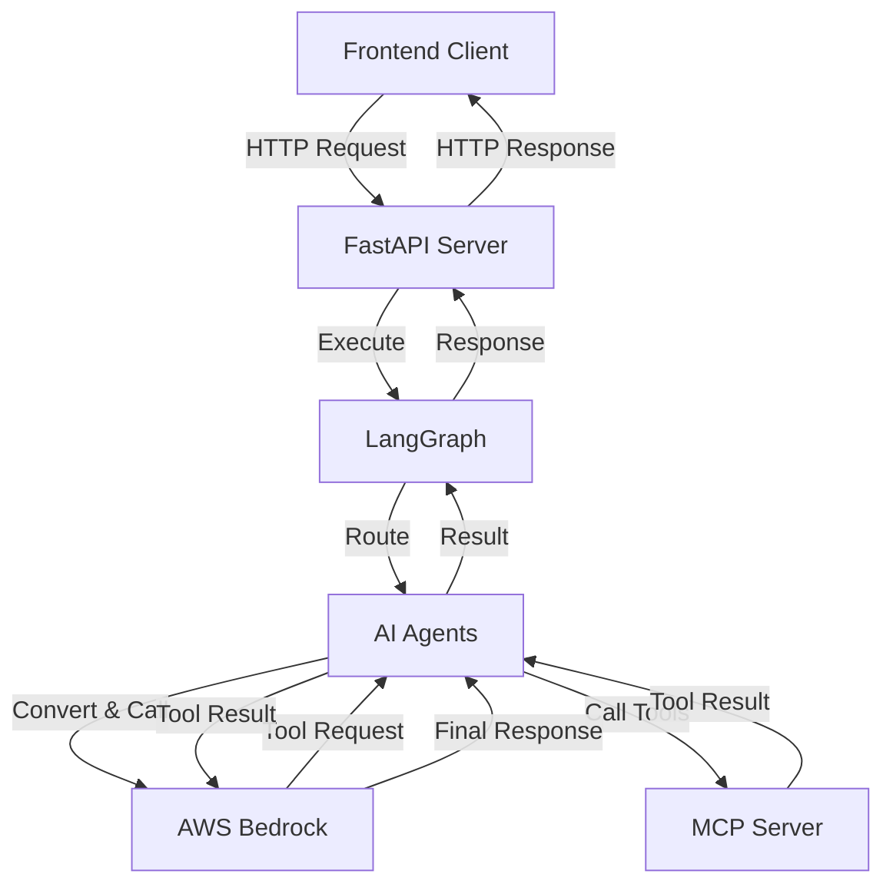
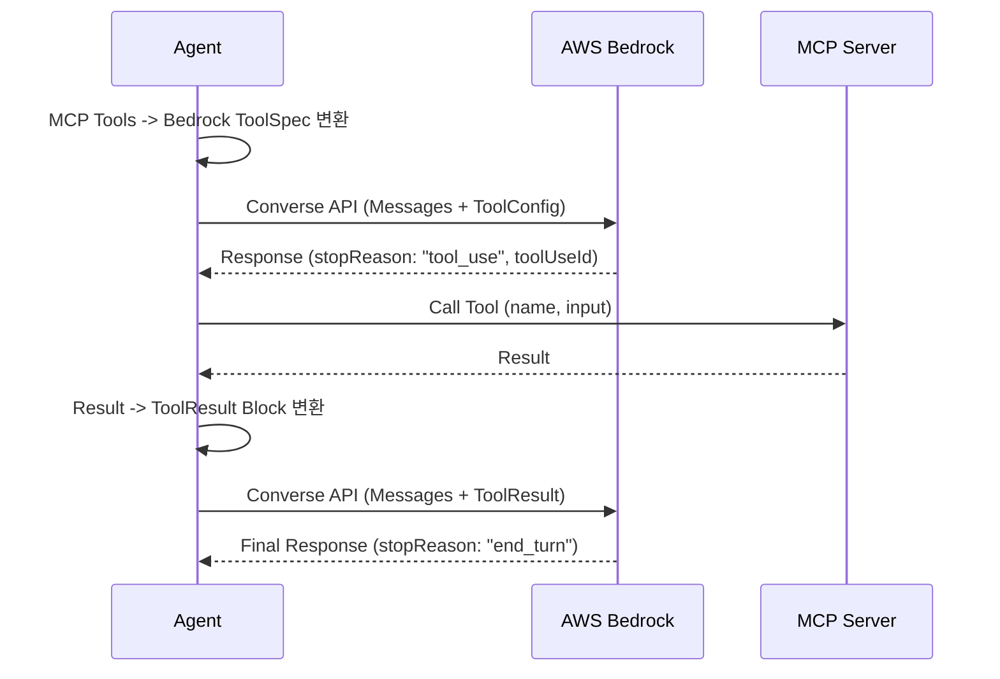

# Multi-Agent System 기술 문서

> **작성일:** 2025-11-24  
> **버전:** 2.2.0  
> **대상:** 개발팀원

---

## 📋 목차

1. [프로젝트 개요](#프로젝트-개요)
2. [시스템 아키텍처](#시스템-아키텍처)
3. [폴더 구조](#폴더-구조)
4. [핵심 컴포넌트](#핵심-컴포넌트)
5. [동작 흐름](#동작-흐름)
6. [Agent 개발 가이드](#agent-개발-가이드)
7. [Graph 개발 가이드](#graph-개발-가이드)
8. [배포 가이드](#배포-가이드)
9. [트러블슈팅](#트러블슈팅)

---

## 프로젝트 개요

### 시스템 설명

Multi-Agent System은 **LangGraph 기반의 다중 에이전트 시스템**으로, 여러 AI Agent가 협력하여 복잡한 작업을 수행합니다. AWS Bedrock의 Converse API를 활용하여 고성능 LLM과 Native Tool Calling을 지원합니다.

### 주요 기능

- ✅ **다중 Agent 협업**: 여러 Agent가 동적으로 라우팅되며 작업 수행
- ✅ **AWS Bedrock 통합**: Converse API를 통한 안정적인 LLM 호출 및 Tool 사용
- ✅ **MCP 통합**: Model Context Protocol을 통한 외부 도구 연동 (Bedrock Native Tool 변환)
- ✅ **세션 관리**: 사용자별 대화 히스토리 관리
- ✅ **동시성 안전**: 세션별 잠금으로 안전한 동시 요청 처리
- ✅ **설정 기반**: YAML 파일로 Agent 및 Graph 구성

### 기술 스택

| 분류 | 기술 |
|------|------|
| **프레임워크** | FastAPI, LangGraph |
| **LLM** | AWS Bedrock (Converse API) |
| **프로토콜** | MCP (Model Context Protocol) |
| **데이터베이스** | In-Memory (MemorySaver) |
| **배포** | Docker, Docker Compose |
| **패키지 관리** | uv |

---

## 시스템 아키텍처

### 전체 구조



### 레이어 구조

```
┌─────────────────────────────────────┐
│         API Layer (FastAPI)         │  ← HTTP 요청/응답 처리
├─────────────────────────────────────┤
│      Graph Layer (LangGraph)        │  ← Agent 플로우 관리
├─────────────────────────────────────┤
│       Agent Layer (Agents)          │  ← 비즈니스 로직 & Tool 실행
├─────────────────────────────────────┤
│    Core Layer (LLM, MCP, Config)    │  ← Bedrock/MCP 클라이언트
└─────────────────────────────────────┘
```

---

## 폴더 구조

### 전체 구조

```
agent/
├── agents/              # Agent 관련 코드
│   ├── base/           # Agent 기본 클래스 (Native Tool Calling 구현)
│   ├── config/         # Agent 설정 (YAML)
│   ├── implementations/# Agent 구현체
│   └── registry/       # Agent 등록 및 관리
│
├── api/                # FastAPI 애플리케이션
│   ├── models/         # Request/Response 모델
│   ├── routes/         # API 엔드포인트
│   ├── app.py          # FastAPI 앱 생성
│   └── lifespan.py     # 앱 라이프사이클 (AWS 인증 설정)
│
├── core/               # 핵심 기능
│   ├── config/         # 설정 관리
│   ├── llm/            # LLM 관리 (Bedrock Converse API)
│   ├── logging/        # 로깅
│   └── mcp/            # MCP 클라이언트
│
├── graph/              # LangGraph 관련
│   ├── builder/        # Graph 빌더
│   ├── config/         # Graph 설정 (YAML)
│   ├── routing/        # 라우터 구현
│   └── factory.py      # Graph 생성 팩토리
│
├── utils/              # 유틸리티
│   └── session_manager.py
│
├── main.py             # 서버 실행 진입점
├── pyproject.toml      # 프로젝트 설정
└── docker-compose.yml  # Docker 구성
```

---

## 핵심 컴포넌트

### 1. Agent (agents/)

#### AgentBase

모든 Agent의 기본 클래스입니다. AWS Bedrock의 Native Tool Calling을 지원합니다.

```python
class AgentBase:
    async def execute_multi_turn(self, state: AgentState) -> AgentState:
        # 1. MCP Tool을 Bedrock ToolSpec으로 변환
        # 2. LLM 호출 (ToolConfig 전달)
        # 3. StopReason 확인 ("tool_use" vs "end_turn")
        # 4. Tool 실행 및 결과 전달 (ToolResult)
        pass
```

**주요 기능:**
- `_convert_mcp_to_bedrock_toolspec()`: MCP Tool 정의를 Bedrock 형식으로 자동 변환
- `_make_decision()`: LLM 호출 및 `stopReason` 분석 ("tool_use" 감지)
- `_execute_tool_action()`: Tool 실행 결과를 Bedrock `toolResult` 포맷으로 변환

### 2. LLM Manager (core/llm/)

#### LLMManager

AWS Bedrock Converse API를 래핑하여 제공합니다.

**주요 기능:**
- **Boto3 Client 재사용**: 성능 최적화를 위해 클라이언트 캐싱
- **Message Conversion**: LangChain/Ollama 메시지 포맷을 Bedrock 포맷으로 변환
- **ToolConfig 지원**: Native Tool Calling을 위한 설정 전달
- **Full Response**: `stopReason`, `usage` 등 전체 응답 반환

### 3. MCP Manager (core/mcp/)

외부 도구 호출을 관리하는 Singleton 클래스입니다. Agent는 MCP Manager를 통해 실제 도구를 실행합니다.

---

## 동작 흐름

### Bedrock Native Tool Calling 흐름



---

## 배포 가이드

### 1. 환경 변수 설정

`.env` 파일에서 AWS Bedrock 및 시스템 설정을 관리합니다.

| 변수 | 설명 | 예시 |
|------|------|------|
| `AGENT_ENVIRONMENT` | 환경 (development/production) | development |
| `AGENT_DEBUG` | Debug | True |
| `AGENT_API_HOST` | Agent 서버 Host | 0.0.0.0 |
| `AGENT_API_PORT` | Agent 서버 Port | 8080 |
| `AGENT_API_VERSION` | Agent 서버 버전 | 2.1.0 |
| `AGENT_LOG_LEVEL` | log 레벨 | 8080 |
| `AGENT_LOG_FILE` | log 파일 위치 | logs/agent_system.log |
| `AGENT_MCP_URL` | MCP 서버 URL | http://localhost:8888/mcp |
| `AGENT_MCP_CONNECTION_RETRIES` | MCP 서버 연결 시도 횟수 | 5 |
| `AGENT_MCP_CONNECTION_TIMEOUT` | MCP 서버 연결 시도 시간 | 2 |
| `AGENT_AWS_REGION` | AWS 리전 | `us-east-1` |
| `AGENT_AWS_BEARER_TOKEN_BEDROCK` | Bedrock 인증 토큰 | `your-token` |
| `AGENT_BEDROCK_MODEL_ID` | 사용할 모델 ID | `openai.gpt-oss-20b-1:0` |
| `AGENT_LLM_TEMPERATURE` | LLM Temperature | 0.1 |
| `AGENT_LLM_TOP_P` | LLM TOP_P | 0.1 |
| `AGENT_LLM_STREAM` | LLM Stream | False |
| `AGENT_LLM_TIMEOUT` | LLM 호출 시도 시간 | 180 |
| `AGENT_AGENTS_MODULE_PATH` | Agent Module 경로 | agents.implementations |

### 2. 실행 방법

```bash
# 의존성 설치
make install

# 개발 서버 실행
make dev

# Docker 배포
make deploy
```

---

## 트러블슈팅

### 1. Bedrock ValidationException

**증상:**
```
ClientError: An error occurred (ValidationException) when calling the Converse operation
```

**원인 및 해결:**
- **ToolConfig 누락**: `toolResult`를 보낼 때는 반드시 `toolConfig`도 함께 보내야 합니다.
- **메시지 순서 위반**: Bedrock은 `User` -> `Assistant` -> `User` 순서를 강제합니다. 연속된 `User` 메시지나 `Assistant` 메시지가 없는지 확인하세요.
- **ToolUseId 불일치**: `toolResult`의 `toolUseId`가 이전 턴의 `toolUseId`와 정확히 일치해야 합니다.

### 2. MCP 연결 실패

**증상:**
```
❌ Failed to connect to MCP
```

**해결:**
- MCP 서버가 실행 중인지 확인하세요.
- `AGENT_MCP_URL`이 올바른지 확인하세요. (Docker 환경에서는 `host.docker.internal` 사용)

### 3. 인증 오류

**증상:**
```
ClientError: An error occurred (UnrecognizedClientException) ...
```

**해결:**
- `AGENT_AWS_BEARER_TOKEN_BEDROCK` 환경 변수가 올바르게 설정되었는지 확인하세요.
- `api/lifespan.py`에서 서버 시작 시 토큰이 로드되는지 로그를 확인하세요.